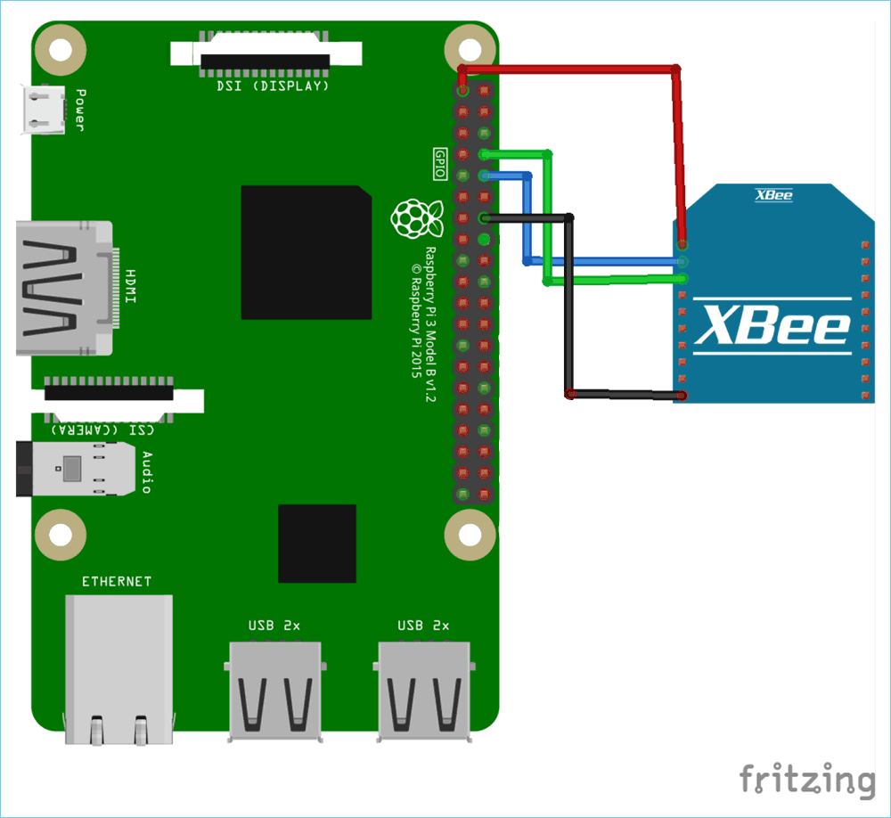
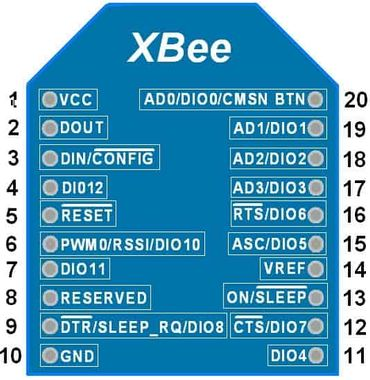

# Le code permet de réaliser :

- la communication inter-robots via XBee (envoi/réception de trames)
- le paramétrage des modules XBee en UART via le port GPIO de la RaspberryPi 

> *Remarque :* Tout les codes sont écrits en style **C/C++**

# Format de la trame des messages envoyés et reçus :

|Début de trame|Adr_emetteur|Adr_destinataire|Id_trame|Nb octets msg|Code_fonction|Paramètres|CRC16 Modbus|Fin de trame|
|:---:|:---:|:---:|:---:|:---:|:---:|:---:|:---:|:---:|
|*1 octet*|*1 octet*|*1 octet*|*1 octet*|*2 octets*|*1 octet*|*255 octets*|*2 octets*|*1 octet*|
|STX|0xXX|0xXX|0xXX|0xXX|0xXX 0xXX|DATA|0xXX 0xXX|EOT|

> *Remarque :* Tous les codes et adresses nécessaires pour la trame sont définis dans le fichier **#define.h**

# Installation du code (sous Linux x86-64) :

```bash
sudo git clone https://github.com/RobotechNancy/2021-2022.git
```

[**Username** : votre nom d'utilisateur GitHub] 

[**Password** : vous devez générer un personal access token dans `Github -> Settings -> Developer Settings -> Personal Access Token -> Generate new token`]

```bash
cd 2021-2022/Pôle\ informatique/Communication/Communication\ inter-robots/xbee/  

sudo g++ *.cpp -o output

./output

```

# Câblage des modules XBee avec la RaspberryPi

### Points de vigilance :

- L'alimentation de la RaspberryPi, pour une RaspberryPi3B+ ou modèle antérieur : 5.5V / 2A max. (utilisez une alimentation de la salle C244)
> une sous-alimentation entraine une dégradation notoire de la communication UART !

> un câble USB/Micro USB de mauvaise qualité entraine un fonctionnement erroné

- Le câblage du module XBee :
> ne pas utiliser les 4 pins situés à l'arrière du [support/adaptateur XBee](./images/adaptateur_xbee.jpg) -> utiliser les pins situés sur le dessous du support **uniquement**

> vérifier le [GPIO Pinout Diagram](https://pinout.xyz) de votre modèle de Raspberry

> les modules XBee s'alimentent en 3,3V

- La compatibilité entre les modules XBee :
> 2 modules XBee ne sont compatibles que s'ils sont du même type (par ex. les modules XBee et XBee Pro ne sont pas compatibles entre eux)

- En cas d'impossibilité d'accès au module XBee et pour vérifier s'il n'est pas endommagé :
> utiliser le logiciel propriétaire [XCTU](https://hub.digi.com/dp/path=/support/asset/xctu-v-658-windows-x86x64/) et connecter le module XBee au port USB de votre ordinateur à l'aide de l'[explorer board XBee](./images/explorer_xbee.jpg)

> dans le logiciel XCTU, cliquez sur l'icône avec la loupe et non celui avec le + pour ajouter un module

- Si vous rencontrez un autre problème, la **meilleure** solution est d'utiliser [un analyseur numérique de signal (ou un oscilloscope)](./images/oscilloscope.jpg), notamment les oscilloscopes digitaux Rohde & Schwarz de la salle C244


### Schéma de câblage :

- Câblage RaspberryPi 3B + Xbee S2C :



- GPIO Pinout Xbee S2C :



- GPIO Pinout RaspberryPi 3B :


> Les pins dessinés en noir non légendés représentent la masse commune de la Raspberry

# Documentation du code :

- toute la documentation a été générée grâce à l'outil [Doxygen](https://www.doxygen.nl/index.html)
- le fichier de configuration de Doxygen se trouve dans le dossie **xbee** (fichier *Doxyfile*)
- pour consulter la documentation, ouvrer le PDF **refman.pdf** dans le dossier `doc -> latex -> refman.pdf`

***
En cas de besoin, contactez moi sur Discord `@heatsink.ru#1183` ou par mail samueldittedestree@protonmail.com
