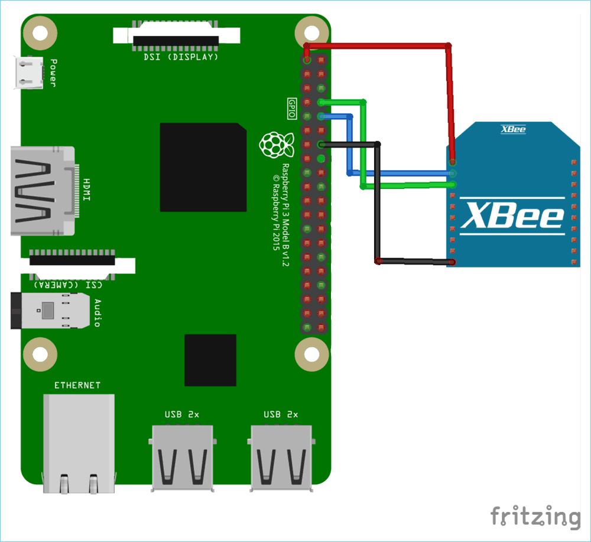
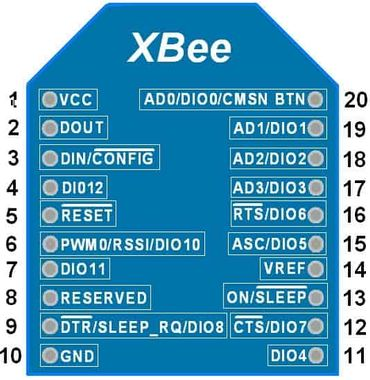
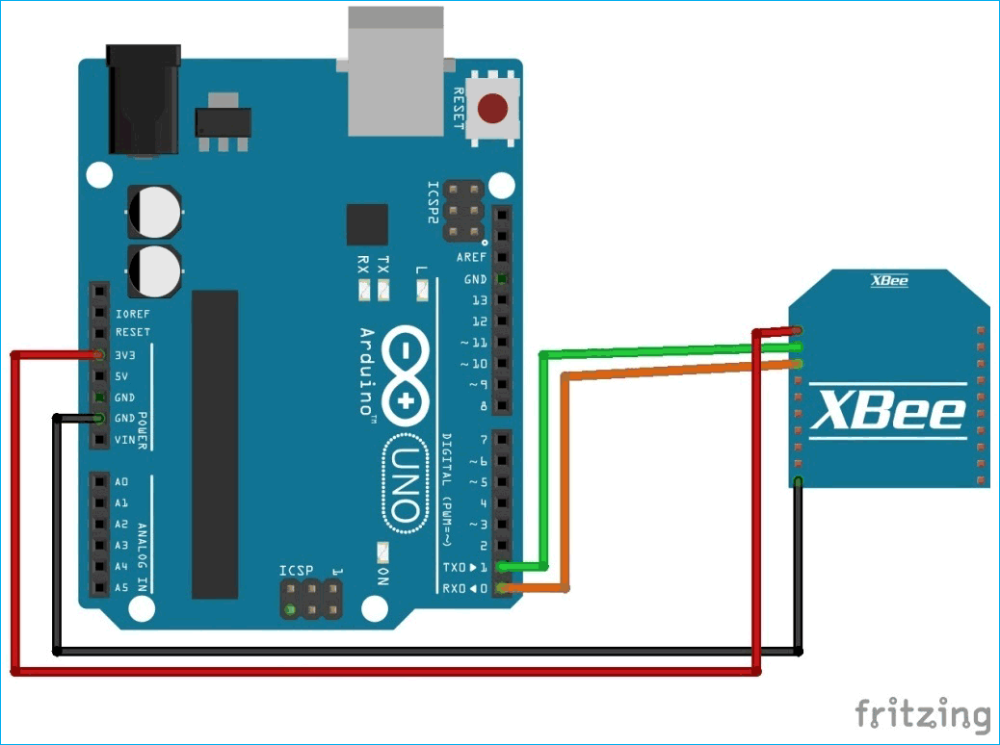

# Le code permet de réaliser :

- la communication inter-robots via XBee (envoi/réception de trames)
- le paramétrage des modules XBee en UART via le port GPIO de la RaspberryPi 

> *Remarque :* Tous les codes sont écrits en style **C/C++**

# Format de la trame des messages envoyés et reçus :

|Début de trame|Adr_emetteur|Adr_destinataire|Id_trame|Nb octets msg|Code_fonction|Paramètres|CRC16 Modbus|Fin de trame|
|:---:|:---:|:---:|:---:|:---:|:---:|:---:|:---:|:---:|
|*1 octet*|*1 octet*|*1 octet*|*2 octets*|*1 octet*|*1 octet*|*<255 octets*|*2 octets*|*1 octet*|
|STX|0xXX|0xXX|0xXX 0xXX|0xXX|0xXX|DATA|0xXX 0xXX|EOT|

> *Remarque :* Tous les codes et adresses nécessaires pour la trame sont définis dans le fichier **#define.h**

# Principales caractéristiques des connexions mises en oeuvre :

|Nom de la communication|Vitesse de transfert|Portée|Type de communication|Caractéristiques de transmission utilisés (série)|Bande(s) de fréquence
|:---:|:---:|:---:|:---:|:---:|:---:|
|Module XBee type S1|RF : 250Kbps - série: jusqu'à 1Mbps|60m (intérieur) - 1200m (extérieur)|Sans fil - Haute Fréquence|9600 bauds - Bit de parité pair - 1 bits de stop - 8 bits de data - chiffrement AES 128 Bits|2,4 GHz avec étalement de spectre|
|Liaison UART|9600 - 115200 bauds|/|Filaire|9600 bauds - Bit de parité pair - 1 bits de stop - 8 bits de data|/|

> Plus d'informations sur le module Digi Xbee 3 DigiMesh 2.4 RF [ici](https://www.digi.com/products/embedded-systems/digi-xbee/rf-modules/2-4-ghz-rf-modules/xbee3-digimesh-2-4#specifications) ou directement sur la [datasheet du module](https://www.digi.com/resources/library/data-sheets/ds_s2c-xbeedigimesh-24)


# Installation du code (sous Linux x86-64) :

```bash
git clone https://github.com/RobotechNancy/2021-2022.git
```

[**Username** : votre nom d'utilisateur GitHub] 

[**Password** : vous devez générer un personal access token dans `Github -> Settings -> Developer Settings -> Personal Access Token -> Generate new token`]

```bash
cd 2021-2022/Pôle\ informatique/Communication/Communication\ inter-robots/xbee/  

g++ *.cpp -std=c++17 -pthread -o output

./output
```

# Publication d'une nouvelle version du code (sous Linux x86-64) :

```bash
git pull && git add * && git commit -m "Version XX.XXR" && git push
```

[**Username** : votre nom d'utilisateur GitHub] 

[**Password** : vous devez générer un personal access token dans `Github -> Settings -> Developer Settings -> Personal Access Token -> Generate new token`]

# Câblage des modules XBee avec la RaspberryPi

### Points de vigilance :

- L'alimentation de la RaspberryPi, pour une RaspberryPi3B+ ou modèle antérieur : 5.5V / 2A max. (utilisez une alimentation de la salle C244)
> une sous-alimentation entraine une dégradation notoire de la communication UART : ne pas utiliser de chargeur de téléphone (même charge rapide) !

> un câble USB/Micro USB de mauvaise qualité entraine un fonctionnement erroné

- Le câblage du module XBee :
> ne pas utiliser les 4 pins situés à l'arrière de l'[adaptateur XBee vers DIM](./images/adaptateur_xbee.jpg) -> utiliser les pins situés sur le dessous du support **uniquement**

> vérifier le [GPIO Pinout Diagram](https://pinout.xyz) de votre modèle de Raspberry

> les modules XBee s'alimentent en 3,3V

- La compatibilité entre les modules XBee :
> 2 modules XBee ne sont compatibles que s'ils sont du même type (par ex. les modules XBee S1 et XBee S2C ne sont pas compatibles entre eux)

- En cas d'impossibilité d'accès au module XBee et pour vérifier s'il n'est pas endommagé :
> utiliser le logiciel propriétaire [XCTU](https://hub.digi.com/dp/path=/support/asset/xctu-v-658-windows-x86x64/) et connecter le module XBee au port USB de votre ordinateur à l'aide de l'[explorer board XBee](./images/explorer_xbee.jpg)

> dans le logiciel XCTU, cliquez sur l'icône avec la loupe et non celui avec le + pour ajouter un module

- Si vous rencontrez un autre problème, la **meilleure** solution est d'utiliser [un analyseur numérique de signal (ou un oscilloscope)](./images/oscilloscope.jpg), notamment les oscilloscopes digitaux Rohde & Schwarz de la salle C244


### Schéma de câblage :

- Câblage RaspberryPi 3B + Xbee S1 :



- GPIO Pinout Xbee S1 :



|**PIN**|**DESCRIPTION**|
|:---:|:---:|
|1|**Alimentation (3,3V)**|
|2|**UART Tx**|
|3|**UART Rx**|
|4|Digital output 8|
|5|Module RESET (pulse reset min. 200ns)|
|6|PWM sortie 0|
|7|PWM sortie 1|
|8|*Ne pas connecter*|
|9|STR / Digital input 8|
|10|**Masse (GND)**|
|11|Analog input 4 / Digital I/O 4|
|12|Clear-to-Send Flow control / Digital I/O 7|
|13|Indicateur d'état du module|
|14|Tension de référence pour les entrées A/D|
|15|Associated Indicator / Analog Input 5 / Digital I/O 5|
|16|Request-to-Send Flow Control / Analog Input 6 / Digital I/O 6|
|17|Analog Input 3 or Digital I/O 3|
|18|Analog Input 2 or Digital I/O 2|
|19|Analog Input 1 or Digital I/O 1|
|20|Analog Input 0 or Digital I/O 0|

- GPIO Pinout RaspberryPi 3B :


> Les pins dessinés en noir non légendés représentent la masse commune de la Raspberry

- Cablâge ArduinoUno + XBee S1 :



# Documentation du code :

- toute la documentation a été générée grâce à l'outil [Doxygen](https://www.doxygen.nl/index.html)
- le fichier de configuration de Doxygen se trouve dans le dossie **xbee** (fichier *Doxyfile*)
- pour consulter la documentation en PDF, ouvrer le fichier **refman.pdf** situé dans le dossier `doc -> latex -> refman.pdf`
- pour consulter la documentation en HTML, ouvrer le fichier **index.html** situé dans le dossier `doc -> html -> index.html`

***
En cas de besoin, contactez moi sur Discord `@heatsink.ru#1183` ou par mail samueldittedestree@protonmail.com
